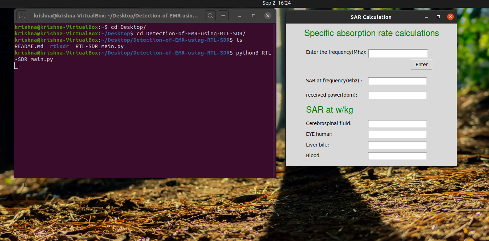
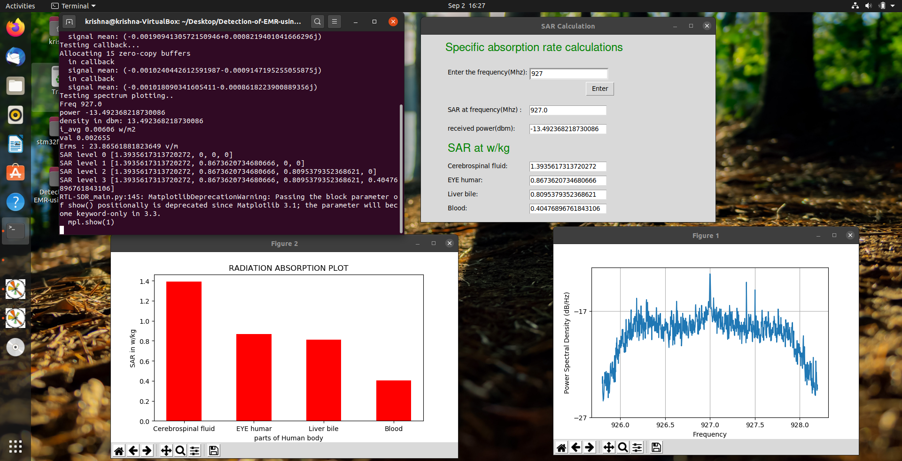

# Detection of EMR using RTL-SDR
## Description
The main motive of this project is to detect the **Electromagnetic radiation** emitted from cell tower :satellite: using **RTL-SDR** (Here **RTL-SDR RTL2832U DVB-T Tuner dongle** is Used ) . The RTL-SDR is connected with **Raspberry PI** :computer: for extraction of Data from it and processed furthur with some MATH :memo: to Derive **SAR** (Specific Absorption Rate) level of different Human body.I have measured **SAR** value for Liver bile, Eye Humar , Blood and Cerebrospinal Fluid. This project helps to Monitor :tv: the Radiation level at different Environment.

## Requirements:
1. RTL-SRD :pager:.
2. Raspberry pi (2+ models) :computer:.

## Pre-Installation on Raspberry pi:
1. python3 :snake:.

## Procedure:
1. Download or close this repository on Raspberry PI.
2. open Detection-of-EMR-using-RTL-SDR folder.
3. open terminal in this path and follow the command.

```
     pi@raspberrypi:~$ python3 RTL_SDR_main.py   
```     

4. Enter the required frequency value in the dialogue Box.
5. Press ENTER button.
6. Results will appear on the Screen.

##  Note:
** This program can run in any OS but the reason for using it in Raspberry pi is because there will a display connected to it for Easy portability and install this Monitoring system any where in the surrounding with minimum power supply.

##  Images:





